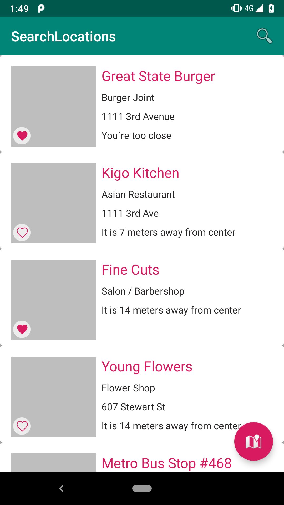
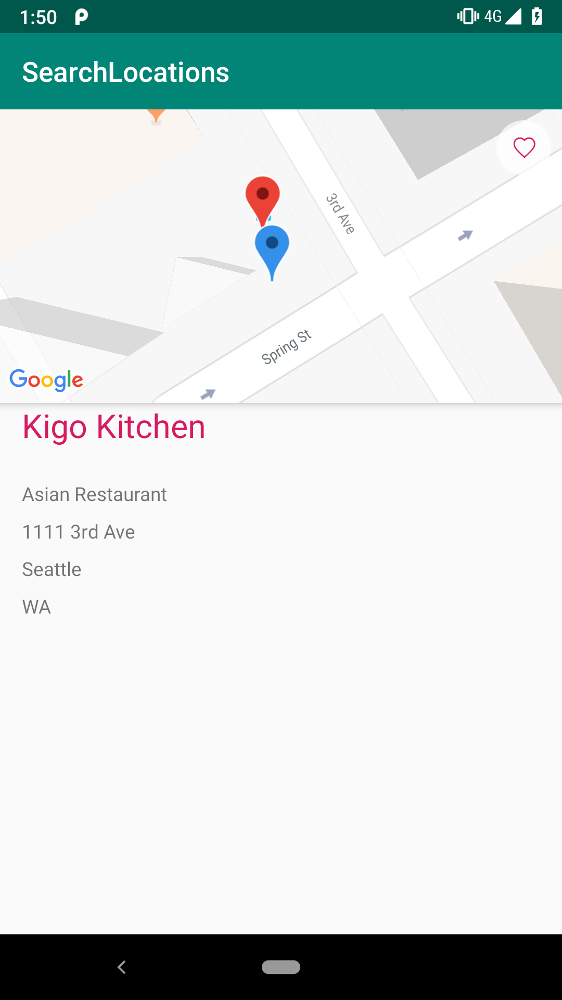
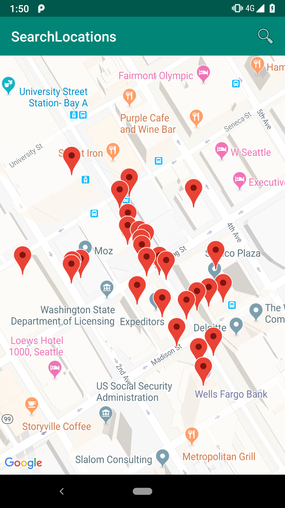

# Search Venues App 

This projects depicts how to build an application following the MVVM architecture pattern by implementing the android architecture components and kotlin as main programming laguage. 

 

## Libraries: 

[Android Architecture Component] (https://developer.android.com/topic/libraries/architecture/)

Android architecture components are a collection of libraries that help you design robust, testable, and maintainable apps. 

[Dagger Android](https://google.github.io/dagger/android.html)

For dependency injection I decided to use Dagger2 plus the dagger android library to inject objects into the android components

[Room Persistence Library] (https://developer.android.com/topic/libraries/architecture/room)

For storing local data I use Room because it gives you a level of abstraction that allows the developer a quick development.

[AndroidX] (https://developer.android.com/jetpack/androidx/)

AndroidX ships separately from the Android OS and provides backwards-compatibility across Android releases. AndroidX fully replaces the Support Library by providing feature parity and new libraries.

[Retrofit] (https://square.github.io/retrofit/)

It's use to consume the endpoints an retrive a LiveData object within the response.

## Some screenshots

